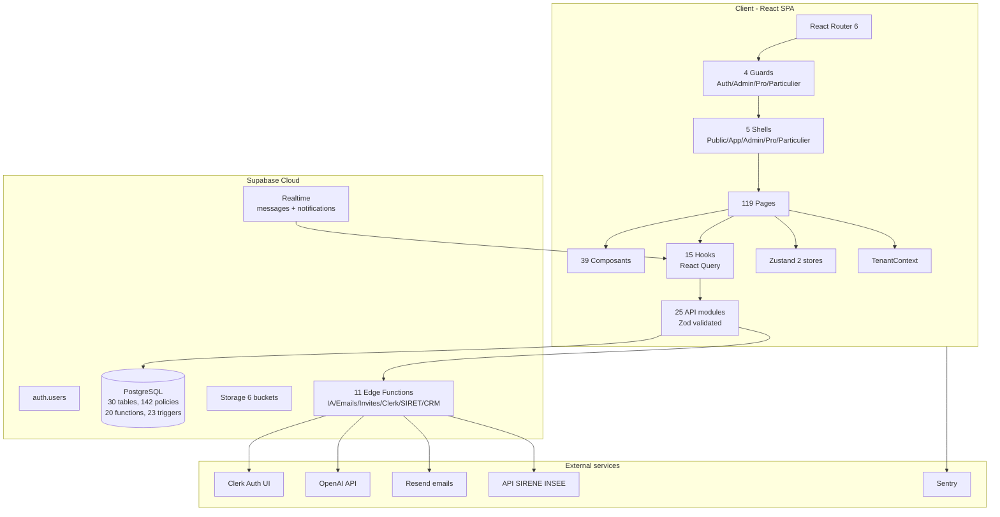
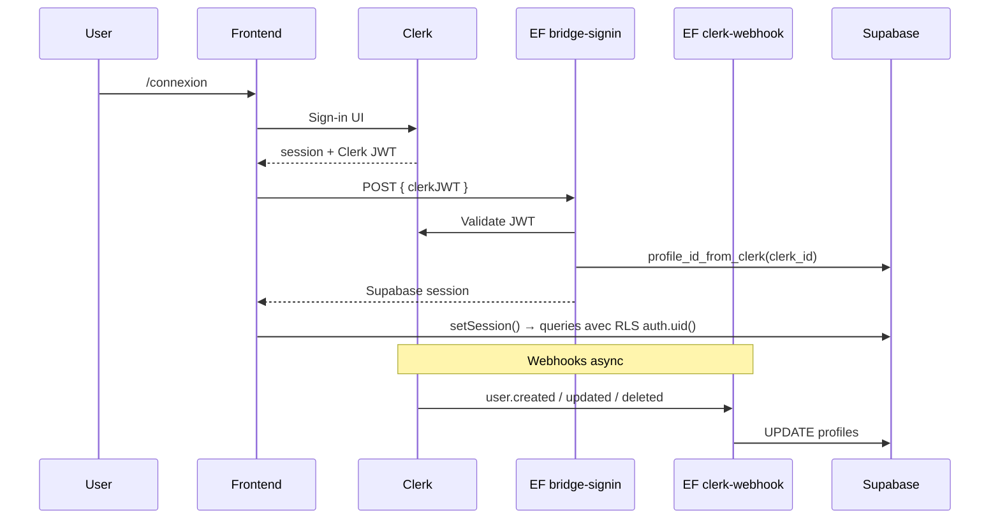

# BRH Habitat — Snapshot architecture (2026-05-12)

> Source : `ARCHITECTURE.md` (audit v7 du 2026-04-14) + inspection directe du code + lint `scripts/verify-wiki.sh`.
> **Dernière mesure** : 2026-05-12 (audit exhaustif post Phases 11→19 + Employé V2.1→V2.5).

## Chiffres-clés (mesurés 2026-05-12 — audit exhaustif)

| Dimension | Valeur exacte | Vérification |
|-----------|---------------|--------------|
| Pages | **199** (.tsx dans src/pages/) | `find src/pages -name "*.tsx" \| wc -l` |
| Composants | **101** (.tsx dans src/components/) | `find src/components -name "*.tsx" \| wc -l` (+ParticulierDashboardGuard 12/05 nuit) |
| Hooks | **71** fichiers (4 base + 67 queries/domaines) | `find src/hooks -name "*.ts" \| wc -l` |
| API modules | **75** (src/api/) | `ls src/api/ \| wc -l` |
| Stores Zustand | **2** | `appStore`, `diagnosticStore` |
| Routes React | **165** (path= dans App.tsx) | `grep -c "path=" src/App.tsx` (+/diagnostic = hub, /diagnostic/rapide = wizard 5 étapes, /audit-complet = wizard 8 étapes CapRénov) |
| Migrations | **104** (supabase/migrations/*.sql) | 2026-02-27 → 2026-07-13 (Phases 1→19 + Employé V2 + Admin V1 quotas + Phase 18 v2 pivot dispos + RDV anon RLS + user audit INSERT + RPC submit public appointment) |
| Tables `brh_*` | **144** (DB + 1 `profiles` extension) | post Phases 11→19 + Employé V2 + Admin V1 + Phase 18 v2 (DPE + foncier + réseau + employés + quotas + disponibilites) |
| Fonctions SQL | **58** (RPC + triggers + computed) | + `brh_submit_public_appointment` (RPC SECURITY DEFINER pour visiteurs anon, fix root cause RDV) |
| Triggers | **30+** | post Phase 13.6.7 commission cascade + 16.1 cascade parrainage + employés + dispos updated_at |
| Policies RLS | **380** (CREATE POLICY across migrations) | post 5 portails + cross-persona feed + agences signataires + dispos + RDV anon (12/05) + user audit INSERT/UPDATE (12/05 nuit) |
| Edge Functions | **41** (+`_shared`) | `ls -d supabase/functions/*/ \| grep -v _shared` |
| Storage buckets | **8+** | audits, brh-commission-invoices, company-logos, home-documents, message-attachments, prospect-files, reseau-media, rewards-catalog, social-screenshots |
| Guards | **9** | AdminGuard, AuthGuard, ParticulierGuard, **ParticulierDashboardGuard** (12/05 fix cross-persona), ProGuard, ArtisanGuard, AgenceGuard, ReseauGuard, EmployeGuard |
| Feature gates utilisés dans App.tsx | **10+** (via `<FeatureRoute>`) | `grep -oE 'feature="[a-z]+"' src/App.tsx \| sort -u` |
| Feature flags définis | **18** | Dans `src/config/tier-presets.ts` |
| Score santé | **9.8/10** (audit v7) · UX **5.4→9/10 cible** | ARCHITECTURE.md + [audit-ux-2026-05-08.md](audit-ux-2026-05-08.md) |

## Stack (versions vérifiées 2026-04-23)

### Frontend
- **React** 19.2.0 + **React Router** 6.30.3 + **TypeScript** 5.9.3 strict
- **Vite** 7.3.1 (build)
- **Tailwind CSS** 4.2.1 (utility-first + `@layer base`)
- **Zustand** 5.0.11 (state client)
- **TanStack React Query** 5.99.0 (state serveur + cache)
- **@react-pdf/renderer** 4.4.0 (génération PDF)
- **react-markdown** 10.1.0 (rendu Markdown)
- **lucide-react** 1.8.0 (icônes)
- **Zod** 4.3.6 (validation API)
- **i18next** 26.0.4 (FR/EN)
- **@sentry/react** 10.48.0 (error tracking)

### Backend / BaaS
- **Supabase** 2.103.0 (PostgreSQL + Auth + Storage + Realtime + Edge Functions)
- **Resend** (emails transactionnels via EFs)
- **Clerk** (auth UI + bridge vers Supabase — migration 20260421100000)

### Deploy
- **Vercel** (SPA) — CSP, HSTS 2 ans, X-Frame-Options DENY
- **Supabase Cloud** — project `lygmmvxnmvlgynmrcpny`

## Architecture des dossiers

```
src/
├── App.tsx                    # Router principal (65+ lazy imports)
├── main.tsx                   # Entry + Sentry ErrorBoundary + SW register
├── index.css                  # Tailwind + @layer base
│
├── pages/                     # 119 pages
│   ├── public/                # Home, services, diagnostic, articles, contact, legal
│   ├── dashboard/             # user : profil, logements, dossiers, rdv
│   ├── admin/                 # dashboard, dossiers, rdv, articles, users, partenaires, commissions
│   ├── pro/                   # dashboard, prospects, pipeline, commissions, équipe, messages, social, IA
│   └── particulier/           # dashboard, parrainages, catalogue, points, messages, social, IA
│
├── components/                # 39 composants
│   ├── auth/                  # AuthGuard, AdminGuard, ProGuard, ParticulierGuard
│   ├── layout/                # AppShell, AdminShell, ProShell, ParticulierShell, PublicShell
│   ├── carnet/                # HealthScoreGauge, HealthOverview, HealthDomainCard, DocumentsList
│   ├── shared/                # CalendarWidget, ChatAI, NotificationBell, PortalMobileNav, FeatureGate
│   ├── ui/                    # AddressAutocomplete, SocialIcons
│   └── pro/                   # MonthlyCAChart, QRCodeDownload
│
├── hooks/
│   ├── useAuth.ts             # login, logout, session, queryClient.clear()
│   ├── useFeature.ts          # Feature flags via TenantContext
│   ├── useNotifications.ts    # Notifications Realtime Supabase
│   ├── useScrollLock.ts       # Modal scroll lock
│   ├── queries.ts             # Base config
│   └── queries/               # 10 hooks React Query (appointments, articles, cases, chiffrages, contacts, dashboard, diagnostics, health, homes, profiles)
│       └── partners/          # 8 sous-fichiers SRP (companies/prospects/members/quotes/affiliates/rewards/social/recruitment) + barrel — refacto 2026-04-29
│
├── api/                       # 25 modules Zod-validated
│
├── stores/                    # 2 stores Zustand
│   ├── appStore.ts            # user, locale, drawerOpen (scope tenant)
│   └── diagnosticStore.ts     # Draft diagnostic multi-étapes (scope tenant)
│
├── lib/                       # 11 utilitaires
├── config/                    # Multi-tenant (TenantContext, tenants/, tier-presets)
├── types/                     # database.ts + partner.ts + index.ts
├── data/                      # 18 fichiers de data statique (diagnostics, services, aides)
└── i18n/                      # FR/EN translations
```

## Les 5 portails

| Portail | Routes | Guard | Shell | Audience |
|---------|--------|-------|-------|----------|
| **Public** | 17 | — | PublicShell | Tout visiteur (diagnostic, services, articles, contact) |
| **Dashboard user** | 7 | AuthGuard | AppShell | Particulier authentifié basique |
| **Admin** | 13 | AdminGuard | AdminShell | Équipe BRH (supervision globale) |
| **Pro** | 17 | ProGuard | ProShell | Partenaires professionnels (architectes, agents immo, courtiers) |
| **Particulier** | 12 | ParticulierGuard | ParticulierShell | Particulier premium (affiliation, gamification) |

### Guards (4)

| Guard | Condition | Redirect | Fichier |
|-------|-----------|----------|---------|
| `AuthGuard` | `isAuthenticated` | `/connexion` | components/auth/AuthGuard.tsx |
| `AdminGuard` | `isAuthenticated && isAdmin` | `/tableau-de-bord` | components/auth/AdminGuard.tsx |
| `ProGuard` | `isAuthenticated && (role='pro' \|\| role='admin')` | `/tableau-de-bord` | components/auth/ProGuard.tsx |
| `ParticulierGuard` | `isAuthenticated && (role='particulier' \|\| role='admin')` | `/tableau-de-bord` | components/auth/ParticulierGuard.tsx |

### Feature gates (10 gates utilisés dans App.tsx)

**Double protection** : Route Guard → FeatureRoute wrapper → Composant

**Features gatées dans les routes** (vérifiées via `grep feature= src/App.tsx`) :
`aiAssistantTechnique`, `aiChiffrage`, `badgesGamification`, `catalogueCadeaux`, `monthlyPdfReport`, `qrCodeGeneration`, `recruitmentPyramid`, `simulationLinks`, `socialMediaPosts`, `teamStats`.

**Features définis dans `tier-presets.ts`** (18 total) : voir [tenant-multitenancy.md](tenant-multitenancy.md).

Features désactivées → redirect vers `/` (pas 404).

## Multi-tenant (TenantContext)

- **Tier BRH** : `enterprise` (toutes features activées)
- 3 tiers définis : `starter`, `pro`, `enterprise` (voir [tenant-multitenancy.md](tenant-multitenancy.md))
- Fichier config : `src/config/tenants/brh.ts`
- Tier presets : `src/config/tier-presets.ts`

## Base de données (vue d'ensemble vérifiée)

- **29 tables `brh_*`** + `profiles` = 30 tables (voir [data-model.md](data-model.md))
- **RLS 100% activée** sur toutes les tables — **142 policies**
- **20 fonctions SQL** :
  - Helpers SECURITY DEFINER (8) : `is_admin`, `is_email_admin` ⭐, `is_pro`, `get_my_role`, `get_my_company_id`, `find_profile_by_email`, `profile_id_from_clerk` ⭐, `validate_recruiter` ⭐
  - Triggers métier (6) : `handle_new_user`, `calculate_commission`, `update_company_ca`, `award_affiliate_points`, `calculate_lead_score`, `calculate_recruitment_commission`
  - RPC stats (6) : `get_company_commission_stats`, `get_full_recruit_tree`, `get_my_threads_enriched`, `get_network_stats`, `get_recruit_stats`, `get_team_stats`
- **23 triggers** (6 métier + 15 `updated_at` + 2 autres)
- **6 storage buckets** : `company-logos`, `home-documents`, `message-attachments`, `prospect-files`, `rewards-catalog`, `social-screenshots`
- **Montants financiers** : INTEGER en centimes (règle anti-bug #2)

## State management

### Zustand stores (2)
| Store | Scope | Persistence | Clear logout |
|-------|-------|-------------|--------------|
| `appStore` | user, locale, drawer | localStorage (scope tenant) | ✅ |
| `diagnosticStore` | draft diagnostic | localStorage `${tenantId}-diagnostic-draft` | ✅ |

### React Query (staleTime par ressource)
```
default: 60s (1 min)
articles: 30 min (statique)
profils: 10 min
homes/cases/diag: 5 min
dashboard: 2 min
retry: 1
refetchOnWindowFocus: false
```

### Logout flow (useAuth.ts)
```typescript
signOut() {
  await supabase.auth.signOut()
  setUser(null)              // Clear Zustand + localStorage
  queryClient.clear()        // Clear ALL React Query cache
  useDiagnosticStore.reset() // Clear diagnostic draft
  useAppStore.closeDrawer()  // Close UI
}
```

### Auth flow (depuis 2026-04-29 — règle anti-bug CLAUDE.md)

**Règle** : `onAuthStateChange` ne charge **plus** le profil. Il gère uniquement `SIGNED_OUT`. Le profil est chargé par les flux de login explicites (LoginPage, RegisterProPage, JoinCompanyPage) après `signInWithPassword/signUp`. La fonction `validateSession()` au mount du hook reste le seul cas légitime de chargement implicite (restauration session après refresh).

**État `error` exposé** : `useAuth().error` retourne désormais `authError: string | null` peuplé dans le catch de `validateSession()`, au lieu d'être hardcodé `null`. Permet aux guards de distinguer "non connecté" de "erreur réseau Supabase".

```typescript
// Pattern correct dans LoginPage / RegisterProPage / JoinCompanyPage :
await supabase.auth.signInWithPassword({ email, password })
const { data: profile } = await supabase
  .from('profiles')
  .select('id, email, full_name, role, avatar_url')
  .eq('id', userId)
  .single()
if (profile) setUser({ ...profile })
```

## Edge Functions (11)

Voir [edge-functions-reference.md](edge-functions-reference.md) pour détails.

| Groupe | Fonctions |
|--------|-----------|
| IA | `ai-proxy`, `chiffrage-prices` |
| Emails | `auto-email`, `send-notification-email` |
| Invitations Pro | `company-invite`, `company-invite-verify`, `company-invite-accept` |
| Auth bridge Clerk | `bridge-signin`, `clerk-webhook` |
| SIRET | `verify-siret` |
| CRM | `crm-sync` |

## Score santé (audit v7 — 2026-04-14)

| Catégorie | Score | Détails |
|-----------|-------|---------|
| Structure | 10/10 | Feature-based, naming cohérent, 65 lazy imports, 0 fichier orphelin |
| Routing & Permissions | 10/10 | 4 guards + 16 feature gates, aucune faille, aucune route morte |
| Data Flow | 9.5/10 | Mutations invalident caches dépendants, staleTime différencié, Zod validation |
| Sécurité DB (RLS) | 10/10 | 33/33 tables RLS, SECURITY DEFINER, storage scoped, INTEGER cents |
| Sécurité Edge Functions | 10/10 | Auth + rate limiting, CORS, validation, error handling |
| Error Handling | 10/10 | Sentry ErrorBoundary + logError(), 0 catch silencieux |
| TypeScript | 9.5/10 | Strict, 0 `as any`, Zod sur API |
| Performance | 9.5/10 | 65 lazy imports, SW cache v3, staleTime différencié |
| DX | 10/10 | API layer Zod, hooks structurés, types à jour, i18n |

**Score global : 9.8/10** — Production-ready.

## Nouveautés post-audit v7 (mi-avril 2026)

Migrations ajoutées depuis le 2026-04-14 :
- `20260414400000_audit_v8_corrections` (v8 corrections)
- `20260420000000_fix_company_select_owner` (RLS fix inscription pro)
- `20260421000000_siret_verification_fields` (stockage data SIRENE officielle)
- `20260421100000_clerk_user_id_bridge` (Clerk ↔ Supabase)
- `20260422000000_admin_emails_list` (table admin emails configurable)
- `20260422100000_validate_recruiter` (validation UUID recruteur)
- `20260423000000_company_invitations` (invitations multi-membres)

Edge Functions ajoutées : `bridge-signin`, `clerk-webhook`, `company-invite`, `company-invite-verify`, `company-invite-accept`, `verify-siret` (vs 5 EF à l'audit v7).

## Statut d'implémentation

### Phases plateforme partenaires (voir [partner-platform.md](partner-platform.md))
- ✅ Phase 1-2 DONE (schéma, auth, triggers commission)
- 🟡 Phase 3-5 en cours (UI portails pro/particulier, features virales)

## Diagramme architectural (Mermaid)



## Flow d'authentification (Clerk ↔ Supabase)



## Mises à jour de cette page

- **2026-04-29** : Refactor SRP `partners/` (8 sous-fichiers + barrel) — structure dossiers mise à jour. Auth flow précisé (post-fix B03/B18) : `onAuthStateChange` ne charge plus le profil, `useAuth().error` exposé. Voir [log.md](log.md) entrée 2026-04-29.
- **2026-04-23 (v2)** : Audit croisé — chiffres exacts vérifiés. Corrections :
  - 30 tables au lieu de "33+"
  - 20 fonctions SQL (au lieu de 12)
  - 142 policies RLS ajoutées
  - 10 feature gates réels dans routes + 18 flags définis
  - 15 hooks (au lieu de 14)
  - Ajout diagrammes Mermaid (architecture + auth flow)
- **2026-04-23 (v1)** : Création initiale.
