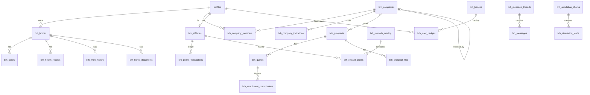

# BRH Habitat — Modèle de données

> Source : migrations `supabase/migrations/*.sql` vérifiées ligne par ligne.
> **Dernière mesure** : 2026-04-23 (audit croisé) · **30 tables** (30 `brh_*` + 1 `profiles`).

## Chiffres vérifiés (`grep CREATE ... migrations/*.sql`)

| Objet | Compte |
|-------|--------|
| Tables `brh_*` | **30** |
| `profiles` (extend auth.users) | 1 |
| Policies RLS | **142** |
| Fonctions SQL | **20** |
| Triggers | **23** (6 métier + 15 `updated_at` + 2 autres) |
| Storage buckets | **6** |

## Conventions

- Toutes les tables métier sont **préfixées `brh_*`** (cohérence multi-tenant)
- `profiles` est partagée (extension de `auth.users`)
- **Montants financiers** : INTEGER en centimes (règle anti-bug #2) — JAMAIS NUMERIC/FLOAT
- **Dates** : TIMESTAMPTZ (pas TIMESTAMP) — règle anti-bug #12
- **RLS 100% activée** sur toutes les tables
- **SECURITY DEFINER** avec `SET search_path = ''` pour éviter recursion circulaire

## Table `profiles` (vérifiée)

```sql
id              UUID PK REFERENCES auth.users(id) ON DELETE CASCADE
email           TEXT UNIQUE NOT NULL
full_name       TEXT         -- ⚠ PAS first_name/last_name séparés
role            TEXT DEFAULT 'user'
                  -- check initial ('user','admin'), étendu ('pro','particulier') migration 20260403100002
avatar_url      TEXT
locale          TEXT DEFAULT 'fr'
phone           TEXT          -- ajout migration 20260403200000
is_active       BOOLEAN       -- ajout migration 20260403200000
clerk_user_id   TEXT UNIQUE   -- ajout migration 20260421100000 (bridge Clerk)
created_at, updated_at TIMESTAMPTZ
```

## Les 29 tables `brh_*` (liste exhaustive)

Liste obtenue via `grep -h "CREATE TABLE brh_" supabase/migrations/*.sql | sort -u`.

### Core habitat (7)

| Table | Rôle |
|-------|------|
| `brh_articles` | Articles éducatifs |
| `brh_appointments` | Rendez-vous (diagnostic, devis, visite) |
| `brh_cases` | Dossiers/cas de rénovation (`estimated_budget` INTEGER cents) |
| `brh_contacts` | Messages formulaire contact public |
| `brh_diagnostics` | Diagnostics habitat multi-étapes (JSONB) |
| `brh_homes` | Logements des utilisateurs |
| `brh_chiffrages` | Chiffrages IA (ajout phase 4, `total_cents` INTEGER) |

### Santé & maintenance habitat (3)

| Table | Rôle |
|-------|------|
| `brh_health_records` | Fiches santé par domaine (toiture, électricité, isolation, VMC, plomberie, menuiserie, chauffage) |
| `brh_work_history` | Historique travaux (`cost_cents` INTEGER) |
| `brh_home_documents` | Documents (factures, contrats, plans) |

### Plateforme partenaires pro (5)

| Table | Rôle |
|-------|------|
| `brh_companies` | Entreprises partenaires (+ champs SIRENE officiels migration 2026-04-21) |
| `brh_company_members` | Membres d'entreprise (multi-user) |
| `brh_company_invitations` | ⭐ 2026-04-23 — invitations multi-membres |
| `brh_prospects` | Prospects apportés (`lead_score`, `estimated_value_cents`) |
| `brh_prospect_files` | Fichiers attachés prospects |

### Commissions & devis (3)

| Table | Rôle |
|-------|------|
| `brh_quotes` | Devis (`amount_cents`, `commission_cents` auto) |
| `brh_recruitment_commissions` | Commissions multi-niveaux (level 1/2/3) |

### Affiliation & points (4)

| Table | Rôle |
|-------|------|
| `brh_affiliates` | Affiliés particuliers — **colonnes vérifiées** : `id, referral_code, short_code, points_balance, total_points_earned, level` |
| `brh_points_transactions` | Ledger points (earned/redeemed) |
| `brh_rewards_catalog` | Catalogue récompenses |
| `brh_reward_claims` | Réclamations récompenses |

### Messagerie (3 — Realtime)

| Table | Rôle | Realtime |
|-------|------|----------|
| `brh_message_threads` | Fils de discussion | — |
| `brh_messages` | Messages | ✅ `postgres_changes` |
| `brh_notifications` | Notifications push | ✅ `postgres_changes` |

### Viral & social (3)

| Table | Rôle | RLS spécifique |
|-------|------|----------------|
| `brh_simulation_shares` | Simulations partagées (code court `short_code`) | — |
| `brh_simulation_leads` | Leads anonymes capturés | **INSERT public `true`** (visiteurs) |
| `brh_social_posts` | Posts réseaux sociaux | — |

### Gamification (2)

| Table | Rôle | RLS spécifique |
|-------|------|----------------|
| `brh_badges` | Catalogue badges | **SELECT public `true`** |
| `brh_user_badges` | Badges débloqués | scope user |

### Config (1)

| Table | Rôle |
|-------|------|
| `brh_platform_settings` | Settings globaux (key/value JSONB) + colonne `admin_emails TEXT[]` ⭐ 2026-04-22 |

## ⚠ Correction importante : pas de table `brh_admin_emails`

Migration `20260422000000_admin_emails_list` **n'a pas créé de table dédiée**. Elle a :
- Ajouté la colonne `admin_emails TEXT[]` à `brh_platform_settings`
- Créé fonction `is_email_admin(p_email TEXT)`
- Modifié `handle_new_user()` pour utiliser la liste dynamique

Default : `ARRAY['contact@contact-brh.fr']`.

## Les 20 fonctions SQL (vérifiées)

### Helpers SECURITY DEFINER (8)

| Fonction | Type | Usage |
|----------|------|-------|
| `is_admin()` | STABLE | Check role admin (via `is_email_admin` + `profiles.role`) |
| `is_email_admin(p_email TEXT)` | STABLE | ⭐ 2026-04-22 — check email dans `brh_platform_settings.admin_emails` |
| `is_pro()` | STABLE | Check role pro |
| `get_my_role()` | STABLE | Retourne role user courant (évite recursion profiles) |
| `get_my_company_id()` | STABLE | Retourne `company_id` user pro courant |
| `find_profile_by_email(p_email TEXT)` | STABLE | Lookup profile (invitations) |
| `profile_id_from_clerk(p_clerk_id TEXT)` | STABLE | ⭐ 2026-04-21 — lookup `profiles.id` via `clerk_user_id` |
| `validate_recruiter(p_recruiter_id UUID, p_expected_role TEXT)` | STABLE | ⭐ 2026-04-22 — valide recruteur UUID (bloque UUID aveugle) |

> ⚠ Nom exact : `validate_recruiter` (pas `validate_recruiter_uuid`). 2 paramètres.

### Triggers métier (6)

| Fonction | Déclenchement | Rôle |
|----------|---------------|------|
| `handle_new_user()` | `AFTER INSERT ON auth.users` | Crée profile + assigne role (via `is_email_admin`) + crée `brh_affiliates` si particulier |
| `calculate_commission()` | `AFTER UPDATE ON brh_quotes` (status → signed) | Calcule `brh_quotes.commission_cents` |
| `update_company_ca()` | `AFTER UPDATE ON brh_quotes` | MAJ `brh_companies.total_ca_apporte` + recalcul `level` |
| `award_affiliate_points()` | `AFTER UPDATE ON brh_quotes` | Insert `brh_points_transactions` |
| `calculate_lead_score()` | `BEFORE INSERT/UPDATE ON brh_prospects` | Calcule `lead_score` |
| `calculate_recruitment_commission()` | `AFTER UPDATE ON brh_quotes` | Cascade recruteurs (level 1/2/3) |

### RPC / Stats (6 — non documentées initialement)

| Fonction | Usage |
|----------|-------|
| `get_company_commission_stats()` | Stats commissions entreprise pour dashboard |
| `get_full_recruit_tree()` | Arbre recrutement multi-niveaux complet |
| `get_my_threads_enriched()` | Threads messagerie avec last_message + unread_count |
| `get_network_stats()` | Stats réseau recrutement (CA pyramide) |
| `get_recruit_stats()` | Stats recrutement mensuel |
| `get_team_stats()` | Stats équipe (gated `teamStats`) |

### Utilitaires (1)

| Fonction | Usage |
|----------|-------|
| `update_updated_at()` | Trigger générique — MAJ colonne `updated_at` |

## Triggers `updated_at` (15 tables)

Trigger `update_updated_at` appliqué sur : `brh_appointments, brh_articles, brh_cases, brh_companies, brh_contacts, brh_diagnostics, brh_health_records, brh_home_documents, brh_homes, brh_prospects, brh_quotes, brh_reward_claims, brh_rewards_catalog, brh_social_posts, brh_work_history`.

## Storage Buckets (6 — vérifiés)

| Bucket | Scope folder | Usage |
|--------|--------------|-------|
| `home-documents` | `{user_id}/` | Factures, contrats, plans du logement |
| `prospect-files` | `{company_id}/` | Fichiers attachés prospects |
| `social-screenshots` | `{company_id}/` | Screenshots posts sociaux |
| `message-attachments` | `{thread_participants}/` | Pièces jointes messagerie |
| `company-logos` | `{company_id}/` | Logos entreprises partenaires |
| `rewards-catalog` | (admin) | Images catalogue récompenses |

> ⚠ **Correction** : il n'y a PAS de bucket `avatars` ni `chiffrage-pdf` (chiffrages PDF sont générés client-side via `@react-pdf/renderer`, téléchargement direct).

## Patterns RLS (142 policies au total)

### Pattern principal (80% des tables)
```sql
CREATE POLICY "{table}_own_company" ON brh_{table}
  FOR ALL TO authenticated
  USING (company_id = public.get_my_company_id())
  WITH CHECK (company_id = public.get_my_company_id());
```

### Pattern user-centric
```sql
CREATE POLICY "{table}_own_user" ON brh_{table}
  FOR ALL TO authenticated
  USING (user_id = auth.uid())
  WITH CHECK (user_id = auth.uid());
```

### Pattern admin bypass
```sql
CREATE POLICY "{table}_admin_all" ON brh_{table}
  FOR ALL TO authenticated
  USING (public.is_admin());
```

### Exceptions intentionnelles
- `brh_badges` : `FOR SELECT USING (true)` — catalogue public
- `brh_simulation_leads` : `FOR INSERT WITH CHECK (true)` — visiteurs anonymes (monitorer spam via ip_hash)
- `brh_articles` : `FOR SELECT USING (published_at IS NOT NULL)` — articles publiés accessibles à tous
- `brh_rewards_catalog` : `FOR SELECT USING (is_active = true)` — catalogue visible aux particuliers

## Colonnes INTEGER cents (vérifiées)

- `brh_cases.estimated_budget` ✅
- `brh_quotes.amount_cents`, `brh_quotes.commission_cents` ✅
- `brh_recruitment_commissions.commission_cents` ✅
- `brh_companies.total_ca_apporte` ✅
- `brh_prospects.estimated_value_cents` ✅
- `brh_chiffrages.total_cents` ✅
- `brh_work_history.cost_cents` ✅
- `brh_rewards_catalog.points_cost` (points, pas cents)

**Affichage** : `(cents / 100).toLocaleString('fr-FR', { style: 'currency', currency: 'EUR' })`.

## Realtime

Activé sur 2 tables (migration `20260403600000`) :
- `brh_messages` → channel par thread
- `brh_notifications` → channel par user

## Diagramme relationnel (Mermaid)



## Règles à suivre

1. **Toute nouvelle table** : préfixe `brh_*` + RLS activée + policies définies + index sur cols filtrées
2. **Toute colonne financière** : INTEGER cents + nom suffixé `_cents`
3. **Toute colonne temporelle** : TIMESTAMPTZ
4. **Toute fonction SECURITY DEFINER** : `SET search_path = ''`
5. **Toute migration** : timestamp UTC en préfixe
6. **Tester avec user non-admin** avant merge
7. **JAMAIS `USING (true)`** sauf exceptions (3 documentées ci-dessus)

## Mises à jour de cette page

- **2026-04-23 (v2)** : Audit croisé — correction erreurs v1.
  - `brh_admin_emails` table → colonne `admin_emails` dans `brh_platform_settings`
  - `profiles.first_name/last_name` → `full_name` unique
  - Buckets `avatars`, `chiffrage-pdf` supprimés (inventés)
  - Buckets `company-logos`, `rewards-catalog` ajoutés (manquants)
  - 20 fonctions SQL listées (au lieu de 12)
  - 23 triggers référencés (au lieu de non chiffrés)
  - 142 policies RLS comptées
  - `brh_affiliates` schéma corrigé (referral_code, short_code, points_balance, total_points_earned, level)
  - `validate_recruiter` (nom exact, pas `_uuid`)
  - Ajout fonctions RPC stats (6 non documentées avant)
  - Ajout diagramme Mermaid
- **2026-04-23 (v1)** : Création initiale.
