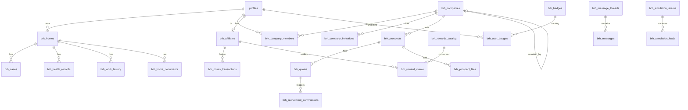

# BRH Habitat — Modèle de données

> Source : migrations `supabase/migrations/*.sql` vérifiées ligne par ligne + lint `scripts/verify-wiki.sh`.
> **Dernière mesure** : 2026-05-12 (audit exhaustif Phases 11→19 + Employé V2) · **143 tables** (142 `brh_*` + 1 `profiles`).

## Chiffres vérifiés (`grep CREATE ... migrations/*.sql`)

| Objet | Compte |
|-------|--------|
| Tables `brh_*` | **142** (8 domaines — voir section dédiée plus bas) |
| `profiles` (extend auth.users) | 1 |
| Policies RLS | **372** (CREATE POLICY dans migrations) |
| Fonctions SQL | **57** (RPC + computed + triggers helper) |
| Triggers | **30+** (updated_at + cascade parrainage + commission + employé scoring) |
| Storage buckets | **8+** (audits, brh-commission-invoices, company-logos, home-documents, message-attachments, prospect-files, reseau-media, rewards-catalog, social-screenshots) |

## Familles de tables (vue d'ensemble)

Voir la section [Tables par domaine (Phases 11→Employé V2)](#tables-par-domaine-phases-11employé-v2) pour le détail exhaustif.

- **Tables métier historiques** (~30) : homes, cases, diagnostics, prospects, companies, affiliates, quotes, messages, notifications, ...
- **Référentiels DPE 3CL 2021** (~45) : tables préfixées `brh_dpe_<element>` (umur, upb, uph, ug, uw, sw, deltar, ujn, uporte, uvue, ue, coef_*, zones_climatiques, seuils, seer, scop_ch, scop_ecs, temp_fonc, etc.)
- **DPE solutions catalogue** : `brh_dpe_solutions` (prix unitaires HT)
- **DPE prospects** : `brh_dpe_prospects` (59k F/G Bretagne) + cache `brh_prospect_studies`
- **Audits énergétiques** : `brh_audits`, `brh_audit_variantes`, `brh_audit_factures`, `brh_audit_emails`
- **Aides** : `brh_aides_locales`, `brh_ext_aides_anil`
- **External data sources** (Phase 11) : `brh_ext_*` (cache, iris, commune, rge_companies, immo_companies, outils_communaux)
- **Pros RGE / Marketplace** (Phase 13.6) : `brh_artisans_rge`, `brh_artisan_*` (8 tables Phase 17.1) + commissions
- **Agences immo** (Phase 16/16.1) : `brh_agences_immo`, `brh_agence_*` (12 tables Phase 16.1 portail complet)
- **Réseau social pro** (Phase 18) : `brh_feed_*`, `brh_pro_*`, `brh_chantier_*`, `brh_autaf_link`, `brh_reseau_subscriptions`
- **Foncier Pro** (Phase 19) : `brh_parcelles_cache`, `brh_sci_*`, `brh_dvf_archive`, `brh_communes_sociodemo`, `brh_plu_summaries`, `brh_satellite_analyses`, `brh_bodacc_alerts`, `brh_permis_construire`
- **Refonte fiches Data-B** (27/05) : colonnes ajoutées sur `brh_sci_companies` (`entity_class` 5-valeurs · `solvabilite_estimee` 6-valeurs · `is_utility` étendu) + table `brh_ext_dgfip_centres` (annuaire SIP/SIE/CDIF géolocalisé Bretagne 35 entrées) + RPC `brh_dpe_by_siren_paged` (pagination + filtres serveur) + `brh_dpe_summary_by_siren` (résumé par commune/DPE class) + `brh_dgfip_nearest` (Haversine)
- **Employés BRH** (Phase Employé V2) : `brh_employees`, `brh_employee_*`, `brh_email_templates`, `brh_email_sends`, `brh_social_publications`, `brh_social_post_templates`

## Conventions

- Toutes les tables métier sont **préfixées `brh_*`** (cohérence multi-tenant)
- `profiles` est partagée (extension de `auth.users`)
- **Montants financiers** : INTEGER en centimes (règle anti-bug #2) — JAMAIS NUMERIC/FLOAT
- **Dates** : TIMESTAMPTZ (pas TIMESTAMP) — règle anti-bug #12
- **RLS 100% activée** sur toutes les tables
- **SECURITY DEFINER** avec `SET search_path = ''` pour éviter recursion circulaire

## Table `profiles` (vérifiée)

```sql
id              UUID PK REFERENCES auth.users(id) ON DELETE CASCADE
email           TEXT UNIQUE NOT NULL
full_name       TEXT         -- ⚠ PAS first_name/last_name séparés
role            TEXT DEFAULT 'user'
                  -- check initial ('user','admin'), étendu ('pro','particulier') migration 20260403100002
avatar_url      TEXT
locale          TEXT DEFAULT 'fr'
phone           TEXT          -- ajout migration 20260403200000
is_active       BOOLEAN       -- ajout migration 20260403200000
clerk_user_id   TEXT UNIQUE   -- ajout migration 20260421100000 (bridge Clerk)
created_at, updated_at TIMESTAMPTZ
```

## Les 29 tables `brh_*` (liste exhaustive)

Liste obtenue via `grep -h "CREATE TABLE brh_" supabase/migrations/*.sql | sort -u`.

### Core habitat (7)

| Table | Rôle |
|-------|------|
| `brh_articles` | Articles éducatifs |
| `brh_appointments` | Rendez-vous (diagnostic, devis, visite) |
| `brh_cases` | Dossiers/cas de rénovation (`estimated_budget` INTEGER cents) |
| `brh_contacts` | Messages formulaire contact public |
| `brh_diagnostics` | Diagnostics habitat multi-étapes (JSONB) |
| `brh_homes` | Logements des utilisateurs |
| `brh_chiffrages` | Chiffrages IA (ajout phase 4, `total_cents` INTEGER) |

### Santé & maintenance habitat (3)

| Table | Rôle |
|-------|------|
| `brh_health_records` | Fiches santé par domaine (toiture, électricité, isolation, VMC, plomberie, menuiserie, chauffage) |
| `brh_work_history` | Historique travaux (`cost_cents` INTEGER) |
| `brh_home_documents` | Documents (factures, contrats, plans) |

### Plateforme partenaires pro (5)

| Table | Rôle |
|-------|------|
| `brh_companies` | Entreprises partenaires (+ champs SIRENE officiels migration 2026-04-21) |
| `brh_company_members` | Membres d'entreprise (multi-user) |
| `brh_company_invitations` | ⭐ 2026-04-23 — invitations multi-membres |
| `brh_prospects` | Prospects apportés (`lead_score`, `estimated_value_cents`) |
| `brh_prospect_files` | Fichiers attachés prospects |

### Commissions & devis (3)

| Table | Rôle |
|-------|------|
| `brh_quotes` | Devis (`amount_cents`, `commission_cents` auto) |
| `brh_recruitment_commissions` | Commissions multi-niveaux (level 1/2/3) |

### Affiliation & points (4)

| Table | Rôle |
|-------|------|
| `brh_affiliates` | Affiliés particuliers — **colonnes vérifiées** : `id, referral_code, short_code, points_balance, total_points_earned, level` |
| `brh_points_transactions` | Ledger points (earned/redeemed) |
| `brh_rewards_catalog` | Catalogue récompenses |
| `brh_reward_claims` | Réclamations récompenses |

### Messagerie (3 — Realtime)

| Table | Rôle | Realtime |
|-------|------|----------|
| `brh_message_threads` | Fils de discussion | — |
| `brh_messages` | Messages | ✅ `postgres_changes` |
| `brh_notifications` | Notifications push | ✅ `postgres_changes` |

### Viral & social (3)

| Table | Rôle | RLS spécifique |
|-------|------|----------------|
| `brh_simulation_shares` | Simulations partagées (code court `short_code`) | — |
| `brh_simulation_leads` | Leads anonymes capturés | **INSERT public `true`** (visiteurs) |
| `brh_social_posts` | Posts réseaux sociaux | — |

### Gamification (2)

| Table | Rôle | RLS spécifique |
|-------|------|----------------|
| `brh_badges` | Catalogue badges | **SELECT public `true`** |
| `brh_user_badges` | Badges débloqués | scope user |

### Config (1)

| Table | Rôle |
|-------|------|
| `brh_platform_settings` | Settings globaux (key/value JSONB) + colonne `admin_emails TEXT[]` ⭐ 2026-04-22 |

## ⚠ Correction importante : pas de table `brh_admin_emails`

Migration `20260422000000_admin_emails_list` **n'a pas créé de table dédiée**. Elle a :
- Ajouté la colonne `admin_emails TEXT[]` à `brh_platform_settings`
- Créé fonction `is_email_admin(p_email TEXT)`
- Modifié `handle_new_user()` pour utiliser la liste dynamique

Default : `ARRAY['contact@contact-brh.fr']`.

## Les 20 fonctions SQL (vérifiées)

### Helpers SECURITY DEFINER (8)

| Fonction | Type | Usage |
|----------|------|-------|
| `is_admin()` | STABLE | Check role admin (via `is_email_admin` + `profiles.role`) |
| `is_email_admin(p_email TEXT)` | STABLE | ⭐ 2026-04-22 — check email dans `brh_platform_settings.admin_emails` |
| `is_pro()` | STABLE | Check role pro |
| `get_my_role()` | STABLE | Retourne role user courant (évite recursion profiles) |
| `get_my_company_id()` | STABLE | Retourne `company_id` user pro courant |
| `find_profile_by_email(p_email TEXT)` | STABLE | Lookup profile (invitations) |
| `profile_id_from_clerk(p_clerk_id TEXT)` | STABLE | ⭐ 2026-04-21 — lookup `profiles.id` via `clerk_user_id` |
| `validate_recruiter(p_recruiter_id UUID, p_expected_role TEXT)` | STABLE | ⭐ 2026-04-22 — valide recruteur UUID (bloque UUID aveugle) |

> ⚠ Nom exact : `validate_recruiter` (pas `validate_recruiter_uuid`). 2 paramètres.

### Triggers métier (6)

| Fonction | Déclenchement | Rôle |
|----------|---------------|------|
| `handle_new_user()` | `AFTER INSERT ON auth.users` | Crée profile + assigne role (via `is_email_admin`) + crée `brh_affiliates` si particulier |
| `calculate_commission()` | `AFTER UPDATE ON brh_quotes` (status → signed) | Calcule `brh_quotes.commission_cents` |
| `update_company_ca()` | `AFTER UPDATE ON brh_quotes` | MAJ `brh_companies.total_ca_apporte` + recalcul `level` |
| `award_affiliate_points()` | `AFTER UPDATE ON brh_quotes` | Insert `brh_points_transactions` |
| `calculate_lead_score()` | `BEFORE INSERT/UPDATE ON brh_prospects` | Calcule `lead_score` |
| `calculate_recruitment_commission()` | `AFTER UPDATE ON brh_quotes` | Cascade recruteurs (level 1/2/3) |

### RPC / Stats (6 — non documentées initialement)

| Fonction | Usage |
|----------|-------|
| `get_company_commission_stats()` | Stats commissions entreprise pour dashboard |
| `get_full_recruit_tree()` | Arbre recrutement multi-niveaux complet |
| `get_my_threads_enriched()` | Threads messagerie avec last_message + unread_count |
| `get_network_stats()` | Stats réseau recrutement (CA pyramide) |
| `get_recruit_stats()` | Stats recrutement mensuel |
| `get_team_stats()` | Stats équipe (gated `teamStats`) |

### RPC Foncier Pro V2 (Phase 19 + Phase 21)

| Fonction | Migration | Usage |
|----------|-----------|-------|
| `brh_foncier_prospects_unified(p_dept, p_score_v2_min, p_segment_v2, p_filter_fioul, p_filter_avec_sci, p_filter_succession, p_search, p_limit, p_offset)` | `20260517100000_brh_foncier_prospects_unified.sql` | Liste unifiée pour `/agence/leads` V2 — retourne 30 colonnes (DPE + coords + détails techniques + propriétaire SIREN). 2 bugs typage corrigés à l'application prod (cf log.md 17/05). Filtre succession utilise `dpe_saut_s1 IS NOT NULL` (à ré-évaluer en V2.1 vers `brh_sci_companies.has_deceased_dirigeant = TRUE`). |

### Composition côté client (Phase 21 — pas de RPC SQL)

Décision 18/05 ([brh_graph_navigable_decisions](../../.claude/memory/brh_graph_navigable_decisions.md)) : pour les fiches drill-down, on évite le pattern RPC unique côté Postgres au profit de la composition côté client (queries Supabase parallèles). Plus debuggable, plus modulable, évite les bugs typage SQL.

| Fonction TS | Fichier | Queries Supabase |
|---|---|---|
| `getFicheAdresse(dpeId)` | [src/api/brh-fiches.ts](../../src/api/brh-fiches.ts) | 3 : `brh_dpe_prospects` by id, `brh_sci_companies` by SIREN, voisinage `brh_dpe_prospects` by `code_postal` |
| `getFicheEntreprise(siren)` | [src/api/brh-fiches.ts](../../src/api/brh-fiches.ts) | 3 : `brh_sci_companies` by SIREN, `brh_dpe_prospects` by `owner_siren`, `brh_bodacc_alerts` by SIREN |
| `getFichePersonneByName(name)` | [src/api/brh-fiches.ts](../../src/api/brh-fiches.ts) | 1 : `brh_sci_companies` ILIKE sur JSONB dirigeants (MVP) |
| `brhRechercheApi.multi(q)` | [src/api/brh-recherche.ts](../../src/api/brh-recherche.ts) | 3 : `brh_dpe_prospects` (adresse/owner_name), `brh_sci_companies` (denomination), `brh_sci_companies` JSONB dirigeants |

### Utilitaires (1)

| Fonction | Usage |
|----------|-------|
| `update_updated_at()` | Trigger générique — MAJ colonne `updated_at` |

## Triggers `updated_at` (15 tables)

Trigger `update_updated_at` appliqué sur : `brh_appointments, brh_articles, brh_cases, brh_companies, brh_contacts, brh_diagnostics, brh_health_records, brh_home_documents, brh_homes, brh_prospects, brh_quotes, brh_reward_claims, brh_rewards_catalog, brh_social_posts, brh_work_history`.

## Storage Buckets (6 — vérifiés)

| Bucket | Scope folder | Usage |
|--------|--------------|-------|
| `home-documents` | `{user_id}/` | Factures, contrats, plans du logement |
| `prospect-files` | `{company_id}/` | Fichiers attachés prospects |
| `social-screenshots` | `{company_id}/` | Screenshots posts sociaux |
| `message-attachments` | `{thread_participants}/` | Pièces jointes messagerie |
| `company-logos` | `{company_id}/` | Logos entreprises partenaires |
| `rewards-catalog` | (admin) | Images catalogue récompenses |

> ⚠ **Correction** : il n'y a PAS de bucket `avatars` ni `chiffrage-pdf` (chiffrages PDF sont générés client-side via `@react-pdf/renderer`, téléchargement direct).

## Patterns RLS (142 policies au total)

### Pattern principal (80% des tables)
```sql
CREATE POLICY "{table}_own_company" ON brh_{table}
  FOR ALL TO authenticated
  USING (company_id = public.get_my_company_id())
  WITH CHECK (company_id = public.get_my_company_id());
```

### Pattern user-centric
```sql
CREATE POLICY "{table}_own_user" ON brh_{table}
  FOR ALL TO authenticated
  USING (user_id = auth.uid())
  WITH CHECK (user_id = auth.uid());
```

### Pattern admin bypass
```sql
CREATE POLICY "{table}_admin_all" ON brh_{table}
  FOR ALL TO authenticated
  USING (public.is_admin());
```

### Exceptions intentionnelles
- `brh_badges` : `FOR SELECT USING (true)` — catalogue public
- `brh_simulation_leads` : `FOR INSERT WITH CHECK (true)` — visiteurs anonymes (monitorer spam via ip_hash)
- `brh_articles` : `FOR SELECT USING (published_at IS NOT NULL)` — articles publiés accessibles à tous
- `brh_rewards_catalog` : `FOR SELECT USING (is_active = true)` — catalogue visible aux particuliers

## Colonnes INTEGER cents (vérifiées)

- `brh_cases.estimated_budget` ✅
- `brh_quotes.amount_cents`, `brh_quotes.commission_cents` ✅
- `brh_recruitment_commissions.commission_cents` ✅
- `brh_companies.total_ca_apporte` ✅
- `brh_prospects.estimated_value_cents` ✅
- `brh_chiffrages.total_cents` ✅
- `brh_work_history.cost_cents` ✅
- `brh_rewards_catalog.points_cost` (points, pas cents)

**Affichage** : `(cents / 100).toLocaleString('fr-FR', { style: 'currency', currency: 'EUR' })`.

## Realtime

Activé sur 2 tables (migration `20260403600000`) :
- `brh_messages` → channel par thread
- `brh_notifications` → channel par user

## Tables par domaine (Phases 11→Employé V2)

> Audit exhaustif 2026-05-12 — toutes les tables `brh_*` créées entre la migration 38 (Phase 1 DPE) et la 99 (Phase Employé V2.5) sont documentées ici, regroupées par domaine logique. Pour les ~30 tables historiques pré-Phase 11, voir la liste exhaustive dans la section [Les 29 tables `brh_*`](#les-29-tables-brh_-liste-exhaustive) plus haut.

### Domaine 1 — DPE Engine 3CL 2021 + Audits + Prospects

Référentiels thermiques officiels (Phase 1 — migrations 04/30-05/01) :

| Table | Colonnes clés |
|-------|---------------|
| `brh_dpe_umur` | coef U mur (matériau, épaisseur, lambda) |
| `brh_dpe_upb` | coef U plancher bas |
| `brh_dpe_uph` | coef U plancher haut |
| `brh_dpe_ug` | coef U vitrage (gaz, espaceur) |
| `brh_dpe_uw` | coef U menuiserie (cadre+vitrage) |
| `brh_dpe_sw` | facteur solaire vitrage |
| `brh_dpe_deltar` | delta R isolation (rapportée) |
| `brh_dpe_ujn` | coef U baie nuit (volets) |
| `brh_dpe_uporte` | coef U porte (matériau) |
| `brh_dpe_uvue` | coef U véranda |
| `brh_dpe_ue` | coef U équivalent (parois) |
| `brh_dpe_coef_reduction_deperdition` | coefficients réduction déperditions |
| `brh_dpe_coef_masque_proche` | coef masque proche (auvent) |
| `brh_dpe_coef_masque_lointain_homogene` | coef masque lointain homogène |
| `brh_dpe_coef_masque_lointain_non_homogene` | coef masque lointain non-homogène |
| `brh_dpe_coef_orientation_pv` | coef orientation photovoltaïque |
| `brh_dpe_zones_climatiques` | 8 zones (H1a-H3) → DJU |
| `brh_dpe_seuils` | seuils étiquettes A-G (CEP/GES) |
| `brh_dpe_seer` | SEER clim |
| `brh_dpe_scop_ch` | SCOP chauffage (PAC) |
| `brh_dpe_scop_ecs` | SCOP ECS (PAC) |
| `brh_dpe_temp_fonc_` | température fonctionnement |
| `brh_dpe_coef_reduction_deperdition_copi` | coef réduction déperditions COPI |
| `brh_dpe_coef_reduction_deperdition_ets` | coef réduction déperditions ETS |
| `brh_dpe_coef_reduction_deperdition_lnc` | coef réduction déperditions LNC (local non chauffé) |
| `brh_dpe_coef_transparence_ets` | coef transparence ETS |
| `brh_dpe_debits_ventilation` | débits ventilation (VMC simple/double flux, hygro) |
| `brh_dpe_facteur_couverture_solaire` | facteur couverture solaire (CESI/SSC) |
| `brh_dpe_generateur_combustion` | générateurs combustion (chaudière fioul/gaz/bois) |
| `brh_dpe_intermittence` | coef intermittence chauffage |
| `brh_dpe_pertes_stockage` | pertes stockage ECS |
| `brh_dpe_pont_thermique` | coef ponts thermiques |
| `brh_dpe_q` | débits Q (échangeurs air-air) |
| `brh_dpe_rendement_distribution_ch` | rendement distribution chauffage |
| `brh_dpe_rendement_distribution_ecs` | rendement distribution ECS |
| `brh_dpe_rendement_emission` | rendement émission (radiateurs/plancher chauffant) |
| `brh_dpe_rendement_generation` | rendement génération (chaudière/PAC) |
| `brh_dpe_rendement_regulation` | rendement régulation (thermostat) |
| `brh_dpe_reseau_chaleur_` | facteur émission CO₂ réseaux de chaleur urbains |

Audits saisie pro (Phase 1) :

| Table | Colonnes clés |
|-------|---------------|
| `brh_audits` | UUID, diagnostic_id, user_id, pro_user_id, home_id, inputs JSONB, results JSONB, CEP, GES, étiquettes A-G |
| `brh_audit_variantes` | audit_id FK, delta_inputs JSONB, scenarios 3CL, cout_total_ttc_cents BIGINT, aides_total_cents BIGINT, economie_annuelle_cents BIGINT |
| `brh_audit_factures` | audit_id FK, consommations réelles électricité/gaz/fioul/bois |
| `brh_audit_emails` | sent_by, recipient_email, status, resend_id (audit trail RGPD) |
| `brh_dpe_solutions` | type_element, prix_unit_ht_cents INTEGER, param JSONB (catalogue prix isolation/ECS/chauffage) |

Prospects DPE (Phase 11 — score v2 composite 22 règles) :

| Table | Colonnes clés |
|-------|---------------|
| `brh_dpe_prospects` | SERIAL id, numero_dpe UNIQUE, étiquettes DPE/GES, adresse, géoloc, aides Kelvin-parity JSONB, chiffrage TTC JSONB, saut DPE s1/s2/s3 JSONB, brh_prospect_id FK, iris_code FK, score_v2 INTEGER, score_v2_segment, score_v2_breakdown JSONB (22 règles), enedis_kwh_logt, dvf_mutation_24m, has_pv_36kw, abf_required |
| `brh_prospect_studies` | prospect_id BIGINT PK FK, study_json JSONB (sortie complète simulateur 8915 : DPE + S1/S2/S3 + aides MPR + DVF), fetched_at — cache études populé via script Node VPS pour 500 prospects |

### Domaine 2 — Aides Bretagne (régionales + locales)

| Table | Colonnes clés |
|-------|---------------|
| `brh_aides_locales` | niveau (regional/dept/intercommune/commune), geste_id, forfait_euros, taux_pct, couleurs_eligibles ARRAY, cumul_mpr/cee/eco_ptz BOOLEAN — seed 8 collectivités bretonnes |
| `brh_ext_aides_anil` | scraped ANIL aides Bretagne (Phase 11.2, complément aides_locales) |

### Domaine 3 — External Data Sources (Phase 11 — score v2 composite)

Cache générique + IRIS + commune Bretagne (2.8k IRIS + 1.2k communes) :

| Table | Colonnes clés |
|-------|---------------|
| `brh_ext_cache` | source TEXT, cache_key, payload JSONB, TTL 30j (cache générique APIs externes) |
| `brh_ext_iris` | IRIS_CODE PK, Filosofi 2021 (med/d1/d9), couleur_mpr, tx_proprio, Enedis conso_resid, GRDF conso_gaz, Recensement 2021 (5 cols) |
| `brh_ext_commune` | INSEE PK, radon_categorie, rga_alea, opah_active, nb_rge_*, dju_18, delta_dju_2050, prix_m2_median_3y, prix_m2_growth_3y, Sit@del2 dynamisme, DVF, LOVAC, TLV, MERIMEE, BASIAS, BASOL, ICPE, fiscalité (TFB/TFNB/TH/TEOM), Cat-Nat inond/tempête/sécheresse, audits ADEME, SRU (assujettie/déficitaire/carencée + taux LLS), ZNIEFF 1/2 count, ABF AC1, lignes HT, population (2008/2016/2022) |
| `brh_ext_rge_companies` | SIRET, nom, adresse, code_qualification, domaine (RGE ADEME 14.8k qualifs) |
| `brh_ext_immo_companies` | SIREN, SIRET, activite, code_insee (companies immobilières) |
| `brh_ext_outils_communaux` | cadastres solaires communaux |

### Domaine 4 — Pros RGE / Marketplace (Phases 13.6 + 17.1)

Marketplace artisans bretons RGE + magic link onboarding + commissions auto-facturées :

| Table | Colonnes clés |
|-------|---------------|
| `brh_artisans_rge` | SIRET CHAR(14) UNIQUE, nom_entreprise, email/telephone, géoloc, geste_specialites TEXT[], rge_certifications JSONB, score_qualite 0-100, taux_conversion_brh NUMERIC, marketplace_active/premium BOOLEAN, profile_id UUID UNIQUE FK |
| `brh_artisan_leads` | artisan_id FK, prospect_id BIGINT FK, geste, estimated_chantier_ttc, expected_commission, status (pending/accepted/declined/quoted/signed/completed/canceled) |
| `brh_artisan_invitations` | artisan_id FK, token TEXT UNIQUE (64 hex), email_to, status (pending/sent/accepted/expired/revoked), expires_at +30j (magic link onboarding) |
| `brh_commission_invoices` | artisan_id FK, period_year/month, nb_leads_completed, total_chantiers_ttc_eur, commission_pct DEFAULT 0.05, total_commission_due_eur, status (pending/invoiced/paid/reconciled/canceled/disputed), stripe_invoice_id |
| `brh_commission_lead_links` | invoice_id FK, lead_id FK, chantier_ttc_eur, commission_eur (audit trail facturation) |
| `brh_cron_runs` | job_name, status, invoices_created, total_commission_eur (log pg_cron) |

Portail artisan enrichi (Phase 17.1, calque structural de Phase 16.1) :

| Table | Colonnes clés |
|-------|---------------|
| `brh_artisan_contributions` | artisan_id FK, propriétaire (nom/email), adresse bien, travaux, budget, urgence, status, commission |
| `brh_artisan_progression` | artisan_id PK FK, tier (bronze/silver/gold/platinum), contributions_count, chantiers_signes |
| `brh_artisan_simulations` | artisan_id FK, inputs/result/scenarios JSONB |
| `brh_artisan_chiffrages` | artisan_id FK, chiffrage Batichiffrage |
| `brh_artisan_social_posts` | artisan_id FK, platform, post_url, status |
| `brh_artisan_referral_commissions` | artisan_id FK, parrainage 100€/charte signée |

### Domaine 5 — Agences Immobilières (Phases 16 + 16.1)

Score vente + opt-out + lead assignments + subscriptions 4 tiers :

| Table | Colonnes clés |
|-------|---------------|
| `brh_agences_immo` | SIRET UNIQUE, raison_sociale, adresse, code_postal/commune, géoloc, carte_T_numero/validite, status (prospect/contacted/partenaire/refused), referred_by_agence_id FK |
| `brh_score_vente_v1` | prospect_id BIGINT PK FK, score 0-100, segment (tres_chaud/chaud/tiede/froid), rules_breakdown JSONB (13 règles), proba_6m NUMERIC 0-1, algo_version |
| `brh_optout_requests` | adresse, email, request_type (opposition/suppression/rectification), matched_prospect_id, processed_at, deadline +30j (Art. 21 RGPD) |
| `brh_lead_assignments` | prospect_id BIGINT FK, agence_id FK, status (pending/released/claimed/contacted/attempted/signed/completed), claimed_at, released_at, contact_log JSONB |
| `brh_agence_subscriptions` | agence_id UUID UNIQUE FK, signer_profile_id FK, tier (discovery/standard/premium/expert), monthly_lead_quota INTEGER, stripe_* (paliers 0€/5 leads, 390€/30, 990€/100, 2490€/illimité) |
| `brh_agence_audits` | audit_id, agence_id FK, prospect_id FK, status, email_sent_at (audits aléatoires 5% leads contactés, cron mensuelle) |

Portail agence complet (Phase 16.1) :

| Table | Colonnes clés |
|-------|---------------|
| `brh_agence_contributions` | agence_id FK, propriétaire (nom/email/telephone), adresse bien, travaux_envisages TEXT[], budget_estime, urgence, status (submitted/qualified/audit_done/quote_signed/completed/rejected), chantier_montant_ttc_cents BIGINT, commission_pct DEFAULT 5, brh_prospect_id FK |
| `brh_agence_progression` | agence_id UUID PK FK, tier (bronze/silver/gold/platinum), contributions_count, chantiers_signes, commissions_earned_cents, social_unlocked/consumed, contribution_unlocked/consumed, referral_unlocked/consumed, bonuses_period_start TIMESTAMPTZ |
| `brh_agence_simulations` | agence_id FK, created_by FK, lead_assignment_id FK, prospect_dpe_id BIGINT FK, titre, adresse, inputs/result/scenarios JSONB, etiquette_dpe, cep_kwh |
| `brh_agence_social_posts` | agence_id FK, submitted_by FK, platform (facebook/instagram/linkedin/tiktok/google_business), post_url, reward_leads DEFAULT 5, status (en_attente/en_cours_verification/validee/refusee/expiree) |
| `brh_agence_referral_commissions` | recruiter_agence_id FK, recruited_agence_id FK, commission_amount_cents DEFAULT 10000, chain_level (1-5), leads_bonus_amount, status (pending/validated/paid/cancelled) — cascade 5 niveaux : N1 100€+5l, N2 25€+3l, N3 10€+2l, N4-5 5€+1l (145€+12leads max par charte) |
| `brh_agence_referral_audit` | commission_id FK, old_status/new_status, actor_profile_id, notes, commission_amount_cents snapshot, chain_level snapshot (append-only audit fraud detection) |
| `brh_agence_members` | agence_id FK, profile_id FK, member_role (signer/employee), permissions JSONB, invited_at, joined_at |
| `brh_agence_favoris_parcelles` | agence_id FK, idu FK, tags TEXT[], notes (Phase 19 Sprint A — favorites cadastrales) |

### Domaine 6 — Réseau Social Pro (Phase 18)

Cross-persona (agences/artisans/architectes/apporteurs) + marketplace chantiers + abonnements Stripe :

| Table | Colonnes clés |
|-------|---------------|
| `brh_pro_connections` | profile_a FK, profile_b FK, status (pending/accepted/rejected), created_at |
| `brh_pro_follows` | follower_id FK, followed_id FK, created_at |
| `brh_pro_endorsements` | endorser FK, endorsed FK, skill, comment (capital social) |
| `brh_pro_subscriptions` | profile_id UUID UNIQUE FK, tier (free/pro/expert), quota_letters_per_month INTEGER, letters_used_this_period, period_start/end TIMESTAMPTZ, stripe_* (SaaS pro RGE Phase 15) |
| `brh_feed_posts` | author_id FK, type (8 types), title, body, media JSONB, tenant_id, audience, visibility |
| `brh_feed_reactions` | post_id FK, profile_id FK, type (like/recommande/expert) |
| `brh_feed_comments` | post_id FK, parent_id FK (threadés), author_id FK, body |
| `brh_feed_impressions` | post_id FK, viewer_id FK, source, dwell_ms (analytics feed) |
| `brh_feed_reports` | post_id FK, reporter_id FK, reason, status (modération) |
| `brh_chantier_offers` | author_id FK, title, description, location, budget_ttc_cents BIGINT, deadline, status (KILLER marketplace, commission 5% HT) |
| `brh_chantier_applications` | offer_id FK, applicant_id FK, message, status (pending/accepted/rejected) |
| `brh_autaf_link` | profile_id FK UNIQUE, autaf_user_id, api_token_encrypted, scopes, last_sync_at, last_error (bridge OAuth AUTAF) |
| `brh_reseau_subscriptions` | profile_id UUID UNIQUE FK, pro_id FK, tier (free/premium/featured/enterprise), stripe_*, amount_cents BIGINT, benefits JSONB cache (V2 Pro Premium 19€, Featured 49€) |

### Domaine 7 — Foncier Pro (Phase 19 A→H)

Cadastre IGN + SCI succession + DVF archive + sociodémo + IA PLU/satellite + BODACC + permis :

| Table | Colonnes clés |
|-------|---------------|
| `brh_parcelles_cache` | IDU CHAR(14) PK, code_insee/prefixe/section/numero, commune, adresse, surface REAL, usage_dominant, revenu_cadastral NUMERIC, proprietaire_info, fetched_at, TTL 90j |
| `brh_sci_companies` | SIREN CHAR(9) PK, denomination, forme_juridique, date_creation/radiation, adresse, dirigeants JSONB [{nom, prenom, date_naissance, est_decede, deces_match_score}], has_deceased_dirigeant BOOLEAN, succession_probable_score 0-100, deces_last_checked_at, latest_deces_date, capital_social_cents BIGINT, **`is_utility` BOOLEAN (ENEDIS/ORANGE/SNCF — non patrimonial)**, **`entity_class` 5-vals** (bailleur_social/sci_patrimoniale/collectivite/utility/autre), **`solvabilite_estimee` 6-vals** (excellente/bonne/correcte/incertaine/risquee/critique), **`dirigeants_jsonb_malformed` BOOLEAN** (mig 20260527220000 — 7 SCI avec dirigeants sociétés mal-parsées par SIRENE scraper, à masquer dans UI) |
| `brh_dirigeants` | id PK, nom/prenom + **nom_norm/prenom_norm GENERATED STORED** (lower + strip non-alpha), date_naissance, est_decede, deces_date, autres_entreprises JSONB (Phase 2C/8.4), tel_pro_via_entreprise, email_pro_via_entreprise, osint_telephone, osint_email, osint_linkedin, **`psy_profile` JSONB** (mig 20260527210000 — profil psy IA structuré généré par EF `dirigeant-psy-profile`), **`psy_profile_generated_at` TIMESTAMPTZ** (TTL 30j recommandé avant régénération) |
| `brh_dirigeant_sci` | dirigeant_id FK → brh_dirigeants, siren CHAR(9), qualite, PRIMARY KEY (dirigeant_id, siren) — table de liaison normalisée (alternative au JSONB dirigeants de brh_sci_companies, alimentée par mig 20260527170000 et 20260527220000) |
| `brh_sci_deces_matches` | siren FK, match_score, audit trail matchid.io (admin only) |
| `brh_dvf_archive` | ID_MUTATION TEXT PK, date_mutation, nature, valeur_fonciere_cents BIGINT, type_local, surface_reelle_bati, parcelle_idu FK, lat/lng, source_year, archive_batch_id (anti-suppression DVF 4-5 ans) |
| `brh_communes_sociodemo` | INSEE CHAR(5) PK, loyers_median_cents BIGINT, taux_vacance_log, elus JSONB, elections JSONB, gentrification_label, gentrification_score |
| `brh_plu_summaries` | code_insee PK, gpu_document_id/type/date, summary JSONB (zones_principales, abf_zones, mentions, synthese), ai_model, ai_tokens_input/output, ai_cost_cents, TTL 180j (résumé PDF via Claude Sonnet 4.6) |
| `brh_satellite_analyses` | parcelle_idu PK, roof_area_m2, roof_age_estimate, orientation, tilt_angle, tree_shade, solar_potential_kwh_year, ai_model, cache 365j (Vision IA aérienne BD ORTHO IGN) |
| `brh_bodacc_alerts` | id_bodacc TEXT PK, famille_avis (commerciales/collectives/radiations/autres), type_avis, date_publication, siren, denomination, prix_cession_cents BIGINT, bodacc_url |
| `brh_permis_construire` | Sit@del2 permis + déclarations préalables (filtre INSEE/dept/idu) |

### Domaine 8 — Employés BRH (Phase Employé V1+V2.1→V2.5)

Cockpit gamifié commerciaux (Pierre Collard) — registre dynamique + scoring auto + templates emails + calendrier RDV + publications sociales + leads progressifs :

| Table | Colonnes clés |
|-------|---------------|
| `brh_employees` | profile_id UUID UNIQUE FK, full_name, email UNIQUE, role_label, activity_score 0-100 (trigger auto via actions), activity_level (standard/pro/expert/master), leads_received_this_month INTEGER reset cron, signature_html, is_active |
| `brh_employee_actions` | employee_id FK, action_type (email_sent/partner_recruited/social_post/rdv_completed/lead_converted/manual_admin), points INTEGER (gamification +5 par email, +10 par social) |
| `brh_employee_calendar` | employee_id FK, day_of_week 0-6, period (morning/afternoon), status (available/unavailable), UNIQUE(employee, dow, period) — créneaux récurrents hebdo |
| `brh_email_templates` | slug UNIQUE, target_audience (artisan/agence_immo/architecte/maitre_oeuvre/autre), subject, body_html, variables JSONB (templates recrutement) |
| `brh_email_sends` | employee_id FK, template_id FK, recipient_email/name/company, resend_message_id, status (sent/opened/clicked/replied/bounced/failed) |
| `brh_social_publications` | employee_id FK, platform (linkedin/tiktok/instagram/facebook/twitter), content_text, publication_url, status (pending/validated/rejected), reach/engagement count |
| `brh_social_post_templates` | slug UNIQUE, platform, title, content, hashtags ARRAY (9 modèles BRH : Loi Climat, recrutement artisans, conseil DPE 30s, etc.) |
| `brh_field_visits` | company_id FK, employee_id FK, target_type (prospect_dpe/artisan/agence_immo), target_id TEXT polymorphe, visit_type (door_to_door/consultation/rappel/rdv_signe), status, notes, lat/lng (tracking terrain Phase R1) |

### Domaine 8b — Réseau Pro (annuaire 15k prospects Bretagne, ownership progressif) — 2026-05-27

Feature lancée pour démarcher les 15 021 entreprises bretonnes (BTP + Immo) depuis l'espace employé. Premier employé à contacter un prospect le verrouille pour les autres (les jeunes voient juste "Suivi par {nom}").

| Table | Colonnes clés |
|-------|---------------|
| `brh_reseau_prospects` | id BIGSERIAL PK, nom, secteur (BTP/Immo), metier_categorie (30 valeurs), nom_gerant/prenom_gerant/qualite, telephone, email, email_site_web, site_web + titre + description, facebook/instagram/linkedin/tiktok/youtube, adresse + code_postal + ville + departement (22/29/35/56) + lat/lng, siret/siren UNIQUE INDEX siret>=14, naf + libellé, forme_juridique, effectif + tranche_libellé, chiffre_affaires, date_creation, description, prestations, logo_url, page_pagesjaunes, note_google + nb_avis, **is_rge** + rge_certifications + rge_domaines + rge_date_validite, sources, date_scraping, source_csv, ingested_at. Indexes : (metier), (dept), (secteur), (is_rge partiel), gin trgm (nom), gin trgm (ville) |
| `brh_reseau_claims` | id BIGSERIAL PK, prospect_id FK UNIQUE (= un seul claim par prospect), user_id FK auth.users, claimed_at, contact_method (phone/email/linkedin/visit/other), **status** (contacte/rdv_pris/partenaire/refus/abandonne), notes, last_action_at trigger touch. RLS : SELECT own or admin · INSERT self+employe/admin · UPDATE own or admin · DELETE admin only |

**RPCs** (`SECURITY DEFINER SET search_path = ''`, GRANT authenticated) :
- `brh_reseau_prospects_list(p_dept, p_secteur, p_metier, p_filter_rge, p_filter_with_email, p_filter_with_site, p_search, p_limit, p_offset, p_claim_filter)` — liste paginée avec **masking automatique des contacts** si claim par autre (defense en profondeur SQL, pas juste UI). p_claim_filter ∈ {all, free, mine}. Tri : non-claim d'abord, puis RGE, puis note Google, puis nom.
- `brh_reseau_prospect_get(p_id)` — JSONB fiche complète avec `can_see_contacts` + `contacts` null si verrouillé pour le caller
- `brh_reseau_claim(p_id, p_method, p_notes)` — claim atomique, throw si already claimed par autre
- `brh_reseau_claim_update(p_id, p_status, p_notes)` — update statut/notes (owner ou admin)
- `brh_reseau_unclaim(p_id)` — libère le prospect (owner ou admin)
- `brh_reseau_stats(p_scope)` — KPI dashboard : total / claimed / free / my_claims / by_dept / by_metier / by_status / top_employees (admin only)

**Routes UI** :
- `/employe/reseau-pro` + `/employe/reseau-pro/:id` (employé)
- `/admin/reseau-pro` + `/admin/reseau-pro/:id` (admin — voit tout y compris claims des autres, peut unclaim)

**Migration** : `20260527230000_brh_reseau_prospects.sql`
**Source data** : `/opt/stack/prospection-bretagne/prospects_bretagne_2026-05-07_FINAL.csv` (script ingest `/opt/stack/prospection-bretagne/ingest_to_brh.py`)

### Domaine 12 — RDV anonymes (fix critique 12/05/2026)

Avant fix : la RLS `brh_appointments` exigeait `auth.uid() IS NOT NULL` pour `INSERT`. Conséquence : tout visiteur public terminant le diagnostic et essayant de prendre RDV via `ContactRdvModal` plantait silencieusement (RLS bloque, frontend affiche « Une erreur est survenue »).

Migration `20260713100000` (appointments anon insert) ajoute la policy :

```sql
CREATE POLICY "Anonymous visitors can create public appointments" ON brh_appointments
  FOR INSERT TO anon
  WITH CHECK (
    user_id IS NULL
    AND contact_name IS NOT NULL AND length(trim(contact_name)) > 0
    AND contact_email IS NOT NULL AND length(trim(contact_email)) > 0
    AND contact_phone IS NOT NULL AND length(trim(contact_phone)) > 0
    AND type IN ('diagnostic', 'contact')
  );
```

Contraintes anti-spam : 3 champs de contact obligatoires + types limités. Le RGPD est conservé via headers logs Supabase (IP + user-agent) côté backend.

### Domaine 11 — Disponibilités pros (Phase 18 v2, pivot 12/05/2026)

Audit-ux-2026-05-12 point #4 — Philippe valide la suppression du fil d'actu libre. Les tables `brh_feed_*` (posts, reactions, comments, impressions, reports) RESTENT en DB pour réversibilité mais ne sont plus exposées côté UI. Le réseau sert désormais à 2 actions structurées : publier un chantier (table existante `brh_chantier_offers`) OU signaler une disponibilité (NOUVELLE table `brh_disponibilites`).

| Table | Colonnes clés |
|-------|---------------|
| `brh_disponibilites` | pro_id UUID FK brh_partner_contracts(id), periode_debut/periode_fin DATE (contrainte coherent), metiers_proposes TEXT[], departements TEXT[], description, capacite_chantiers INTEGER, contract_mode_pref CHECK (sous_traitance/co_traitance/apport/tous), visibility CHECK (public/reseau/prive) DEFAULT 'reseau', status CHECK (draft/active/archived/expired), expires_at TIMESTAMPTZ, archived_at TIMESTAMPTZ. Indexes GIN sur metiers/depts pour filtres rapides. Trigger updated_at. RLS alignée avec brh_chantier_offers (helper brh_pro_in_network pour visibility='reseau'). |

Helper SQL ajouté : `brh_expire_old_disponibilites()` SECURITY DEFINER — passe en status='expired' les dispos dont periode_fin est dépassée. À appeler par cron quotidienne.

### Domaine 10 — Admin Quotas Granulaires (Phase Admin V1)

Override admin du quota leads par profil + détection automatique des profils dormants (audit-ux-2026-05-12 point #5) :

| Table | Colonnes clés |
|-------|---------------|
| `brh_admin_profile_warnings` | target_type (agence/artisan/employe), target_id UUID polymorphe, warning_type (dormant_no_lead/quota_unused/inactive_login/manual), severity (info/warning/critical), message, metadata JSONB, created_at, created_by, resolved_at, resolved_by, resolved_notes — audit trail des overrides admin + alertes profils dormants 60j |

ALTER cols ajoutées : `custom_quota INTEGER NULL` + `quota_period TEXT DEFAULT 'monthly' CHECK (weekly|monthly)` sur `brh_agence_subscriptions`, `brh_employees`, `brh_artisans_rge`. NULL = use tier default (5/30/100/∞ agences, 5/15/35/∞ employés). RPC `brh_admin_set_custom_quota(target_type, target_id, custom_quota, quota_period)` SECURITY DEFINER admin-only avec audit trail automatique. RPC `brh_detect_dormant_profiles(threshold_days)` idempotente pour cron mensuelle.

### Domaine 9 — Partner Platform élargi (post-Phase R1)

Tables ajoutées ou étendues depuis le partner platform initial :

| Table | Notes |
|-------|-------|
| `brh_partner_contracts` | Étendu Phase 18 : partner_type CHECK +architecte, maitre_oeuvre, apporteur_affaires, courtier, syndic, autre (9 types total). Multi-tenant : tenant_id IN ('brh','idf','paca','autaf') |
| `brh_prospect_letters` | prospect_id BIGINT FK, generated_by UUID, subject TEXT, body_md TEXT, signature, score_v2_snapshot, signaux_used JSONB, status (draft/edited/sent/archived), model_used, input/output/cache tokens, generation_duration_ms (Phase 13 IA killer — courriers prospect auto Claude) |
| `brh_prospect_studies` | Voir Domaine 1 (cache études) |

### Fonctions SECURITY DEFINER ajoutées (Phases 11→19 + Employé)

Liste non-exhaustive des RPC ajoutées (57 fonctions au total, voir `grep -hE "CREATE.*FUNCTION public\." supabase/migrations/*.sql`) :

- `brh_user_pro_id()` — UUID pro du user courant (Phase 11)
- `brh_foncier_prospects_filtered()` — RPC filtres prospects (Phase 11.1b)
- `brh_foncier_prospects_table()` — RPC paginé 13 filtres (Phase 11.4)
- `brh_artisan_respond_lead()` — accept/decline/quote/sign/complete lead atomique (Phase 13.6)
- `brh_artisans_set_updated_at()` — trigger updated_at
- `brh_artisan_invite_accept(token)` — vérifie token + lie profile (Phase 13.6.5)
- `brh_gen_artisan_token()` — 32 bytes → 64 hex
- `brh_generate_commission_invoices(year, month, pct)` — agrège chantiers completed mensuel (Phase 13.6.7)
- `brh_cron_generate_previous_month_commissions()` — wrapper pg_cron mensuel
- `brh_user_is_active_agence_signer()` — true si user signataire charte agence active (Phase 16.0.6 fix)
- `brh_get_public_agence()` — infos publiques minimales agence pour vitrine QR (Phase 16.1.1.7)
- `brh_grant_lead_claim()` — consomme lead depuis (tier → contribution → referral → social) atomique, retourne (assignment_id, consumed_from TEXT) (Phase 16.1 + Step C)
- `brh_get_my_lead_breakdown()` — détail 4 sources disponibles agence courante (Phase 16.1)
- `brh_agence_credit_referral_leads()` — trigger plafond 30 leads/mois/parrain anti-abus MLM (Phase 16.1 Step C)
- `brh_agence_referral_notify_recruiter()` — trigger notification cloche Realtime (Phase 16.1 Step C)
- `brh_agence_social_reward_trigger()` — crédite bonus_leads_unlocked à validation post social
- `brh_agence_subs_set_quota()` — trigger set quota selon tier (5/30/100/NULL)
- `brh_reset_agence_monthly_quotas()` — cron release expired + reset quota
- `brh_generate_monthly_audits(p_audit_month)` — sample 5% leads contactés (Phase 16.0.8)
- `brh_sci_recompute_succession_score(p_siren)` — recalcul score succession après matching décès (Phase 19.B)
- `brh_dvf_commune_stats` — RPC score gentrification (Phase 19.C)

### Storage buckets ajoutés (Phases 1→Employé V2)

| Bucket | Usage | Limite | Privé/Public |
|--------|-------|--------|--------------|
| `audits` | PDFs audits DPE (path `{auditId}/audit.pdf`) | 20 MB | privé (signed URL 30j) |
| `brh-commission-invoices` | PDFs factures commissions artisans (path `{artisan.id}/{year}/{month}.pdf`) | 10 MB | privé |
| `reseau-media` | Images posts feed (jpeg/png/webp) | 10 MB | privé (signed URLs, RLS : auth lit _public.jpg, owner lit _original.jpg) |

## Diagramme relationnel (Mermaid)



## Règles à suivre

1. **Toute nouvelle table** : préfixe `brh_*` + RLS activée + policies définies + index sur cols filtrées
2. **Toute colonne financière** : INTEGER cents + nom suffixé `_cents`
3. **Toute colonne temporelle** : TIMESTAMPTZ
4. **Toute fonction SECURITY DEFINER** : `SET search_path = ''`
5. **Toute migration** : timestamp UTC en préfixe
6. **Tester avec user non-admin** avant merge
7. **JAMAIS `USING (true)`** sauf exceptions (3 documentées ci-dessus)

## Mises à jour de cette page

- **2026-04-23 (v2)** : Audit croisé — correction erreurs v1.
  - `brh_admin_emails` table → colonne `admin_emails` dans `brh_platform_settings`
  - `profiles.first_name/last_name` → `full_name` unique
  - Buckets `avatars`, `chiffrage-pdf` supprimés (inventés)
  - Buckets `company-logos`, `rewards-catalog` ajoutés (manquants)
  - 20 fonctions SQL listées (au lieu de 12)
  - 23 triggers référencés (au lieu de non chiffrés)
  - 142 policies RLS comptées
  - `brh_affiliates` schéma corrigé (referral_code, short_code, points_balance, total_points_earned, level)
  - `validate_recruiter` (nom exact, pas `_uuid`)
  - Ajout fonctions RPC stats (6 non documentées avant)
  - Ajout diagramme Mermaid
- **2026-04-23 (v1)** : Création initiale.
